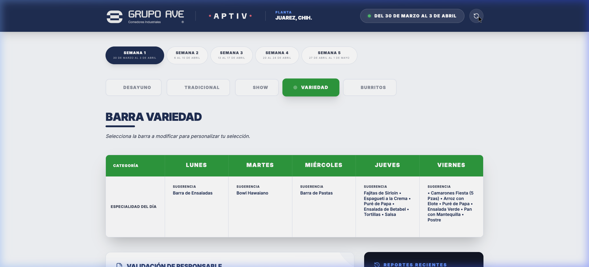
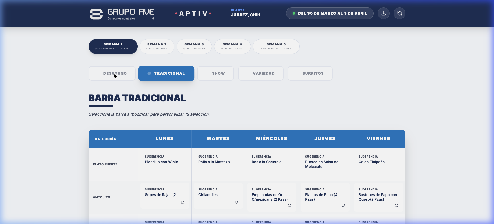
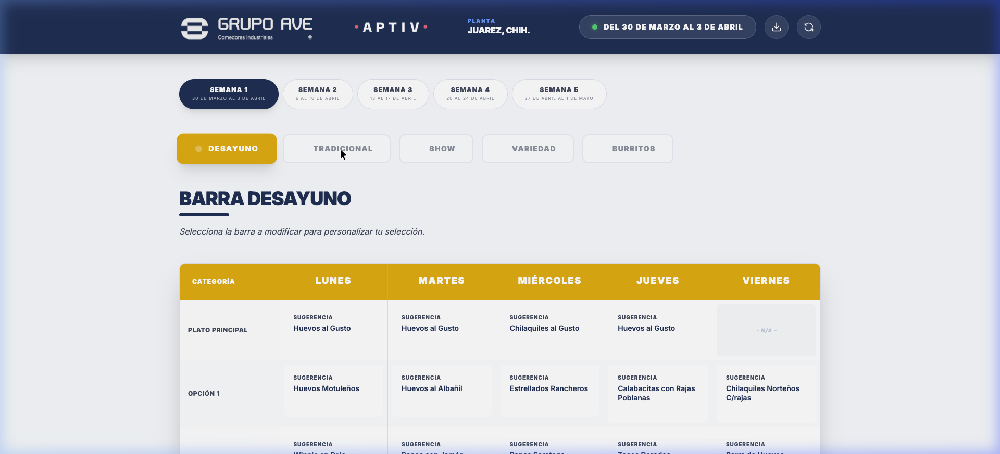
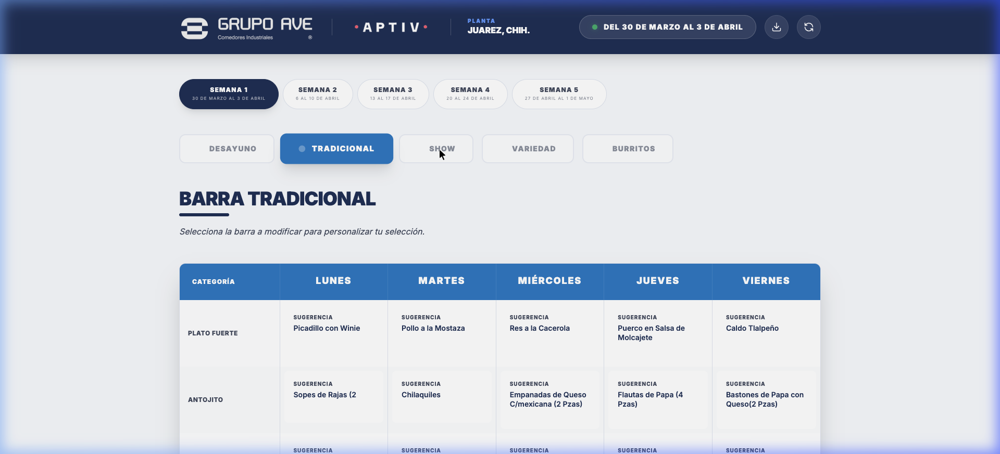
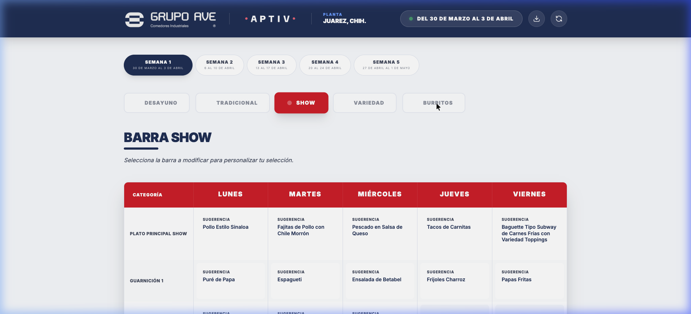
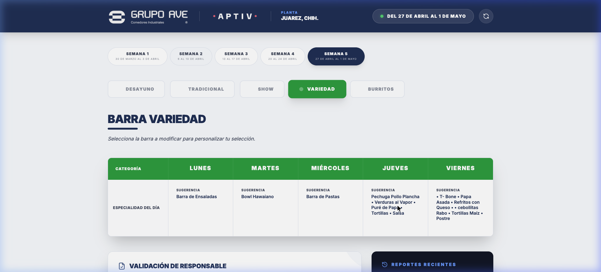

    

        
    

    
    <h1>Guía Rápida de Aprobación</h1>
    
<strong>Plataforma:</strong> Selector de Menú - Grupo Ave

## Introducción

Bienvenido al sistema de **Aprobación de Menú de Grupo Ave**. Esta plataforma está diseñada para que, como responsable de planta, puedas revisar velozmente el menú sugerido para el mes, realizar los ajustes que consideres necesarios día por día, y generar tu autorización formal en cuestión de minutos.

---

## 1. Navegación por Semanas y Barras

El sistema organiza todos tus platillos de forma clara para que no pierdas ningún detalle.

<ul>
  <li><strong>Semanas:</strong> En la parte superior encontrarás botones indicadores (ej. <em>SEMANA 1</em>, <em>SEMANA 2</em>). Haz clic en cualquiera de ellos para ver el menú correspondiente a esas fechas.</li>
  <li><strong>Barras:</strong> Justo debajo, encontrarás las categorías de servicio de tu comedor (ej. <em>Desayuno, Tradicional, Variedad, Show, Burritos</em>). Al hacer clic en una barra, la tabla principal te mostrará la oferta gastronómica planeada para cada día de la semana.</li>
</ul>

### Catálogo de Barras Disponibles

    

        
        
Desayuno

    

    

        
        
Tradicional

    

    

        
        
Show

    

    

        
        
Burritos

    

---

## 2. Personalización de Platillos

El equipo de Grupo Ave siempre te mostrará una **"Sugerencia"** inicial, pero tú tienes el control total para cambiar el plato fuerte del día según las preferencias de tu personal.

<strong>¿Cómo cambiar un platillo?</strong>
<ol>
  <li>Busca el día y el platillo que deseas alterar en la tabla.</li>
  <li>Haz <strong>clic sobre la tarjeta blanca</strong> del platillo.</li>
  <li>Se desplegará una lista con Opciones Alternativas disponibles para ese día en concreto.</li>
  <li>Selecciona tu platillo preferido. El sistema registrará tu cambio y marcará la tarjeta en azul indicando que fue "Modificado".</li>
</ol>

_Repite este sencillo paso en cualquier otra barra o semana donde desees hacer ajustes._

---

## 3. Validación y Firma Digital

Una vez que estés conforme con la selección de menús para todas las semanas, el último paso es asentar tu validación oficial.

<ol>
  <li>Desplázate hacia la <strong>parte inferior de la página</strong>, debajo de la tabla de menús.</li>
  <li>Ubica la sección titulada <strong>"VALIDACIÓN DE RESPONSABLE"</strong>.</li>
  <li>Ingresa tu <strong>Nombre y Apellido</strong>, así como el <strong>Puesto o Cargo</strong> que desempeñas.</li>
  <li>Revisa el resumen de aprobación y haz clic en autorizar para que tu firma quede sentada en el documento final.</li>
</ol>

---

## 4. Descarga de Menú en PDF

Para tus propios controles, reuniones de área o impresión física para tablero, la plataforma te permite exportar el menú ya autorizado con máxima fidelidad visual.

<ul>
  <li>Una vez validado, ubica el botón de descarga principal (icono rojo de documento PDF) situado en el módulo de validación o panel de reportes.</li>
  <li>Este botón generará un <strong>documento PDF profesional</strong> que contendrá exclusivamente la selección exacta de platillos que acabas de configurar, incluyendo todos los días de las semanas y la estampa de tu autorización.</li>
</ul>

_En caso de tener dudas con configuraciones especiales, no dudes en contactar directamente a tu ejecutivo de cuenta en Grupo Ave._
